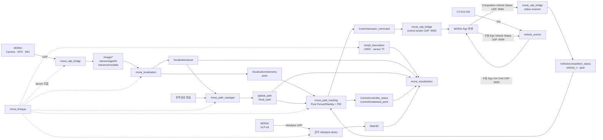

# 2026 MORAI 자율주행 ROS1 워크스페이스

MORAI SIM의 센서 데이터를 ROS1으로 받아 차량 위치와 경로를 만들고 RViz에서
검증하기 위한 Team Stier 워크스페이스다.

현재 구현 범위는 **센서 수신, 차량·센서 TF, GPS+IMU localization,
전역·지역경로 발행, Pure Pursuit/Stanley 선택형 자율 경로 추종, RViz 시각화, 조이스틱
수동 제어**다.

## 현재 구성

| 항목 | 기준 |
| --- | --- |
| 운영체제 | Ubuntu 20.04 |
| ROS | ROS Noetic |
| 시뮬레이터 | MORAI `25.S4.MolitComp03` |
| 지도 | K-City 2025 |
| 차량 | 2023 Hyundai IONIQ 5 |
| 차량 원점 | 뒷바퀴 축 중앙 |
| Localization | noise off 환경의 GPS XY + IMU yaw 직접 결합 |
| Local path | 현재 위치부터 전방 100 m, 일반적으로 약 201 pose |

## 아키텍처



좌표계와 TF는 다음 기준을 사용한다.

```text
map
└── base_footprint
    └── base_link                  # 뒷바퀴 축 중앙, x 전방, y 좌측, z 위
        ├── gps_link               # (0.0, 0.0, 1.2)
        ├── imu_link               # (1.5, 0.0, 0.5)
        ├── lidar_link             # (1.5, 0.0, 1.25)
        └── camera_*_link
```

## 패키지

| 패키지 | 책임 |
| --- | --- |
| [`ioniq5_description`](src/ioniq5_description/README.md) | 차량 제원, 센서 장착값, URDF와 고정 TF |
| [`morai_udp_bridge`](src/morai_udp_bridge/README.md) | Camera/GPS/IMU/Competition Status UDP 수신과 자율 제어 UDP 송신/watchdog |
| [`morai_localization`](src/morai_localization/README.md) | GPS 좌표 투영, IMU 정규화, pose·TF와 odometry velocity 추정 |
| [`morai_path_manager`](src/morai_path_manager/README.md) | 전역경로 로드와 전방 100 m local path |
| [`morai_path_tracking`](src/morai_path_tracking/README.md) | localization pose, Competition x속도와 local path의 선택형 횡제어/PID 자율 제어 |
| [`morai_visualization`](src/morai_visualization/README.md) | Path/LiDAR RViz profile과 디버그 marker |
| [`morai_bringup`](src/morai_bringup/README.md) | 위 패키지의 launch와 config 조합 |
| [`vehicle_control`](src/vehicle_control/README.md) | CYVOX 조이스틱 입력과 MORAI 차량 제어 UDP 송신 |

패키지는 자신의 기능만 담당한다. 예를 들어 UDP bridge는 지도 좌표를 계산하지
않고, visualization은 localization이나 경로를 생성하지 않는다.

## 처음 설치

저장소를 `~/catkin_ws`에 받은 뒤 ROS 의존성을 설치하고 install space를 만든다.

```bash
cd ~/catkin_ws
source /opt/ros/noetic/setup.bash
rosdep install --from-paths src --ignore-src -r -y
catkin_make install
source ~/catkin_ws/install/setup.bash
```

새 터미널을 열 때마다 다음 두 줄을 다시 실행해야 한다.

```bash
source /opt/ros/noetic/setup.bash
source ~/catkin_ws/install/setup.bash
```

## MORAI 준비

저장소의 기준 파일을 MORAI Launcher의 같은 종류 `SaveFile` 폴더로 복사한 뒤
MORAI에서 불러온다.

| 종류 | 저장소 기준 파일 | MORAI 대상 |
| --- | --- | --- |
| 센서 preset | [`0725demo.json`](src/ioniq5_description/config/morai_presets/0725demo.json) | `SaveFile/Sensor/25.S4.MolitComp03/` |
| 빈 시험 시나리오 | [`2026_molit_path_start_empty.json`](src/morai_bringup/config/morai_scenarios/R_KR_PR_K-city_2025/2026_molit_path_start_empty.json) | `SaveFile/Scenario/R_KR_PR_K-city_2025/` |
| 전역경로 | [`2026_molit_comp_global_path.txt`](src/morai_path_manager/map/R-KR_PG_K-City_2025/2026_molit_comp_global_path.txt) | ROS 패키지에서 직접 사용 |

현재 주요 UDP port는 Camera `9291/9293/9295`, GPS `9301`, IMU `9303`,
LiDAR `2368`, Competition Vehicle Status 수신 `9094`, Ego Ctrl Cmd 송신
`9093`이다. MORAI의 각 Destination IP/Port를 해당 YAML과 맞춘다.

## 실행

### 기능별 실행

센서 계층만 실행하면 Camera/GPS/IMU bridge와 공식 Velodyne driver가 올라온다.

```bash
roslaunch morai_bringup molit_2026_sensors.launch
```

Localization만 실행:

```bash
roslaunch morai_bringup molit_2026_localization.launch
```

Path manager만 실행:

```bash
roslaunch morai_bringup molit_2026_path_manager.launch
```

센서, localization, path manager 전체 실행:

```bash
roslaunch morai_bringup molit_2026_stack.launch
```

자율 경로 추종 기본 실행:

```bash
roslaunch morai_bringup molit_2026_autonomous.launch
```

자율 launch는 기본 LiDAR를 포함하고, Competition Vehicle Status receiver,
선택형 Pure Pursuit/Stanley 횡제어와 PID, `/control/actuator_command` UDP sender를 실행한다. RViz는
별도 실행한다. 기본 직선 목표 속도는 `58.0 km/h`이며 실제 PID 피드백은
`/vehicle/competition_status.velocity_x_mps`다.

MORAI Network Settings에서 Competition Vehicle Status Destination IP를 ROS PC,
Destination Port를 `9094`로 설정한다. 수신 설정은
`morai_udp_bridge/config/molit_2026_vehicle_status.yaml`, controller 설정은
`morai_path_tracking/config/molit_2026_path_tracking.yaml`에서 변경한다.

MORAI UDP `9093`에는 송신자를 하나만 실행한다. 따라서 자율 sender와 수동
`vehicle_control` sender를 절대로 동시에 실행하지 않는다. `vehicle_control`은
독립된 수동 제어 패키지이며 이 자율 launch로 변경되지 않는다.

각 기능 launch는 RViz를 자동으로 열지 않는다. 필요한 화면을 별도 터미널에서
bringup의 시각화 진입점으로 연다.

```bash
roslaunch morai_bringup path.launch
roslaunch morai_bringup lidar.launch
roslaunch morai_bringup path_lidar.launch
```

### CYVOX 조이스틱으로 차량 조작

MORAI에서 Ego Controller를 `AV-ExternalCtrl`로 선택하고 Cmd Control의 Host
Port를 `9093`, Destination Port를 `9094`로 설정한 뒤 실행한다. 기어 변경 시
MORAI 차량 상태 속도를 우선 사용하고, 상태가 없으면 localization odometry를
사용한다. 두 속도 입력이 모두 없어도 브레이크 인터록으로 기어를 변경할 수
있으므로 localization 없이도 조이스틱 제어가 동작한다.

```bash
roslaunch vehicle_control cyvox_morai.launch
```

기본 조작은 왼쪽 스틱 좌우 조향, RT 가속, LT 브레이크다. 두 트리거를 놓으면
자동 브레이크 없이 타력 주행 명령을 보낸다. A/B/X/Y는 각각 D/N/R/P 기어를
선택하며, RT를 놓고 LT 브레이크를 50% 이상 밟아야 기어가 바뀐다. Home/Guide
버튼은 X11의 MORAI `Simulator` 창에 초기화 키를 보내 차량을 시작 위치로
되돌린다.

## 핵심 토픽

| 단계 | 토픽 | 타입 |
| --- | --- | --- |
| GPS 입력 | `/sensors/gps/fix` | `sensor_msgs/NavSatFix` |
| IMU 입력 | `/sensors/imu/data` | `sensor_msgs/Imu` |
| LiDAR | `/lidar3D` | `sensor_msgs/PointCloud2` |
| GPS local 좌표 | `/localization/gps/local_point` | `geometry_msgs/PointStamped` |
| 최종 위치·yaw | `/localization/pose` | `geometry_msgs/PoseStamped` |
| 최종 odometry | `/localization/odometry` | `nav_msgs/Odometry` |
| 자율 Competition 차량 상태 | `/vehicle/competition_status` | `morai_udp_bridge/CompetitionVehicleStatus` |
| 전역경로 | `/global_path` | `nav_msgs/Path` |
| 제어용 부분경로 | `/local_path` | `nav_msgs/Path` |
| 자율 차량 명령 | `/control/actuator_command` | `morai_udp_bridge/ActuatorCommand` |
| 자율 제어 상태·안전 사유 | `/control/controller_status` | `morai_path_tracking/ControllerStatus` |
| 횡제어 추종점(Pure Pursuit LD / Stanley 전륜 투영점) | `/control/lookahead_point` | `geometry_msgs/PointStamped` |
| Path marker | `/visualization/path` | `visualization_msgs/MarkerArray` |
| 조이스틱 입력 | `/joy` | `sensor_msgs/Joy` |
| 수동 제어용 MORAI 차량 상태 | `/vehicle/status` | `vehicle_control/VehicleStatus` |
| 수동 차량 명령 | `/vehicle/manual_command` | `vehicle_control/VehicleCommand` |
| MORAI 초기화 요청 | `/vehicle/reset_request` | `std_msgs/Empty` |
| 센서 상태 | `/diagnostics` | `diagnostic_msgs/DiagnosticArray` |

## 설정을 바꿀 때

| 변경 대상 | 기준 파일 |
| --- | --- |
| 차량 제원 | `ioniq5_description/config/vehicle_specs.yaml` |
| 센서 위치·frame·카메라 FOV | `ioniq5_description/config/molit_2026_sensor_mounts.yaml` |
| MORAI 센서 preset | `ioniq5_description/config/morai_presets/0725demo.json` |
| UDP IP·port·topic | `morai_udp_bridge/config/molit_2026*.yaml` |
| Competition Status UDP 수신 | `morai_udp_bridge/config/molit_2026_vehicle_status.yaml` |
| UTM offset·yaw·동기화 | `morai_localization/config/molit_2026_kcity.yaml` |
| 전역/local path 정책 | `morai_path_manager/config/molit_2026_kcity_route_path.yaml` |
| 횡제어기 선택·제어 게인·목표 속도·안전 임계값 | `morai_path_tracking/config/molit_2026_path_tracking.yaml` |
| 자율 제어 UDP sender·watchdog·optional gear | `morai_udp_bridge/config/molit_2026_control.yaml` |
| RViz marker | `morai_visualization/config/path_visualizer.yaml` |
| 조이스틱 축·안전 동작·제어 UDP | `vehicle_control/config/cyvox_mx.yaml` |
| 실행 조합 | `morai_bringup/launch/*.launch` |

센서 위치나 port를 바꾸면 MORAI preset과 ROS YAML을 함께 수정한다. 지도나
시나리오가 바뀌면 localization offset과 전역경로도 한 쌍으로 검증한다.

## 빠른 점검

```bash
rostopic hz /sensors/gps/fix
rostopic hz /sensors/imu/data
rostopic echo -n 1 /localization/pose
rostopic echo -n 1 /global_path
rostopic echo -n 1 /local_path
rostopic echo -n 1 /vehicle/competition_status
rostopic echo -n 1 /control/actuator_command
rostopic echo -n 1 /control/controller_status
rostopic echo -n 1 /control/lookahead_point
rostopic echo -n 1 /joy
rostopic echo -n 1 /vehicle/status
rostopic echo -n 1 /vehicle/manual_command
rosrun tf tf_echo map base_link
rostopic echo /diagnostics
```

- `velodyne_pointcloud`를 찾지 못하면 `rosdep install` 또는
  `sudo apt install ros-noetic-velodyne`을 실행한다.
- 센서 토픽이 없으면 MORAI Destination IP/Port와 사용 중인 bridge config를
  확인한다.
- 전역경로만 있고 local path가 없으면 `/localization/pose` 입력을 확인한다.
- RViz `Global Status: Error`이면 `/localization/pose`와 `map -> base_link`
  TF부터 확인한다.
- `Address already in use`가 나오면 같은 UDP port의 기존 launch를 종료한다.
- Home 초기화가 안 되면 `xdotool` 설치 여부, X11 세션 여부와
  `xdotool search --onlyvisible --name Simulator` 결과를 확인한다.

## 현재 제한

- GPS/IMU noise를 끈 상태를 기준으로 한다. pose는 GPS XY와 IMU yaw를 직접
  결합하고, odometry velocity는 위치 차분을 차량 좌표계에서 `0.10 s` 1차 LPF로
  필터링한다. 자율 PID는 이 추정값 대신 Competition Vehicle Status x속도를
  사용한다.
- noise를 켤 때는 pose fusion을 EKF/UKF 계층으로 교체해야 한다.
- CYVOX는 P/R/N/D 수동 선택을 지원하지만 자율 제어기와의 제어권 중재는 아직
  구현하지 않았다.
- 자율 기어 토픽과 정지/brake interlock은 UDP bridge에 준비되어 있지만 대회
  서버가 기어를 관리하므로 기본 `gear_command_enabled: false`다.
- 자율 sender와 수동 `vehicle_control` sender의 제어권 중재는 구현하지
  않았으므로 두 UDP sender를 동시에 실행하지 않는다.
- K-City가 아닌 map에서는 UTM offset과 전역경로를 다시 설정해야 한다.

경로 제어 인터페이스는
[`CONTROL_PATH_INTERFACE_KO.md`](src/morai_path_manager/docs/CONTROL_PATH_INTERFACE_KO.md)를
참고한다.
